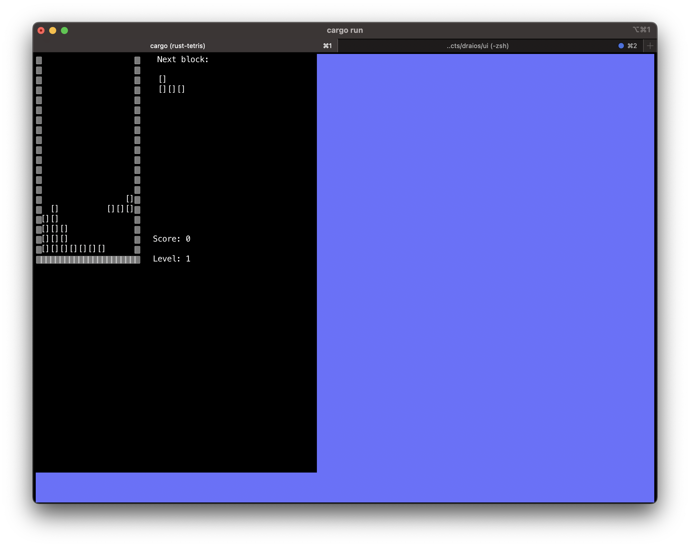

# Tetris

Tetris is an open source terminal arcade game with audio, based off of the "TETRIS" classic arcade game.

This game was made using [this other project](https://github.com/CleanCut/invaders) as starting point.

This simple game would not exists without [CleanCut](https://github.com/CleanCut) and his [Rust video curse](https://www.udemy.com/course/ultimate-rust-crash-course/?referralCode=AF30FAD8C6CCCC2C94F0)

### Build and run

After setting up Rust and Cargo on your computer, simply run

    cargo run

### Sound Files

All audio files were downloaded from https://mixkit.co/free-sound-effects/game/

### Dependencies on Linux

Audio should work out-of-the-box on macOS, Windows, and iOS.  For Linux, the
downstream package for actually _playing_ sound ([CPAL]) requires
the *Alsa* development libraries to be installed.

**CentOS**

```bash
sudo yum install -y alsa-lib-devel
```

**Debian/Ubuntu**

```bash
sudo apt install libasound2-dev pkg-config
```

## Contribution

All contributions are assumed to be dual-licensed under MIT/Apache-2.

## License

Distributed under the terms of both the MIT license and the Apache License (Version 2.0).

See [license/APACHE](license/APACHE) and [license/MIT](license/MIT).

## Screeshot

